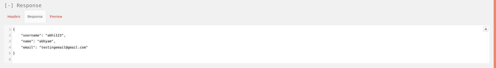
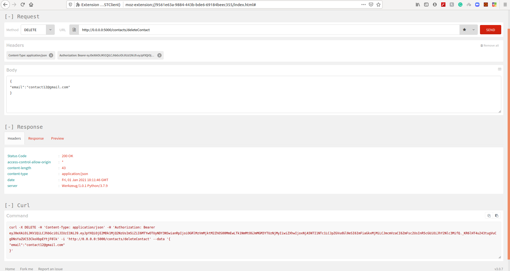

# Contacts project ( Morr | Backend Engineer Intern Assignment )
This repo contains the basic project, involving use of APIs to perform all basic tasks(CRUD) and access the contacts database, it also have the authentication system of it's own.
> This repo is completely related to morr assignment for internship.

## How to Configure and Test

This repo contains all the necessary and required files and folders that will be used to run this project.
Just follow the steps and you will be able to run this project on production level.

> by deafult I configured it to run on production mode. If want to run this project on debug mode then go to file main.py then comment line no. 6 and uncomment line no. 4 then follow the same steps as below.

<br>

**Steps are as follows:-**

- First Create a vrtual enviornment.
  ```python3.7
  $ python3.7 -m venv morr-venv
  ```
- Source it (in ubuntu you can do as follows, but for windows search on internet).
  ```python3.7
  $ source ./morr-venv/bin/activate
  ```

- Install all the dependencies.
  ```python3.7
  $ python3.7 -m pip install -r requirements.txt
  ```
  > you need to have python3.7 installed by default in your system.

- Run the project
  ```python3.7
  $ python3.7 main.py
  ```
<br>

## APIs and their Usages
Here I have defined two different APIs sets, one for `user` related processing and one for `contacts` related processing.
<p>
The `user` related processing is defined to create many individual users which have their own contacts-book, where each user can store thousands of contacts of their personal use.
</p>

<p>
Also the `user` related APIs provide extra level of security as each user can only be able to access their contacts when verifies/logined otherwise they don't get access.
</p>

<p>
Here the verificatoin is done by first registering the user followed by logging it in and then assigning a unique special token to the user, which the user will use in it's all other API transactions which require authentication as a header value.

> Header's syntax is like:- Name:Authorization, Attribute value: Bearer \<access token\> 

</p>

<br>

> Here I will `POSTMAN` API tester in my all further demostratons.

#### Demonstration of api methods

- User related APIs:-
  - Create a User Profile.
    - Method: POST
    - URL/ENDPOINT: https://0.0.0.0:8080/registerUser
    - HEADERS: { "content-type" : "application/json" }
    - BODY: { "email": \<email\>, "password": \<password\>, "name": \<name\>, "username": \<username\> }
    - 
    - Response message:- 

  - Login User.
    - Method: POST
    - URL/ENDPOINT: https://0.0.0.0:8080/loginUser
    - HEADERS: { "content-type" : "application/json" }
    - BODY: { "id": \<email/username\>, "password": \<password\> }
    - 
    - Response message:- 

  - Check your profile.
    - Method: GET
    - URL/ENDPOINT: https://0.0.0.0:8080/profileUser
    - HEADERS: { "content-type" : "application/json", "Authorization" :" Bearer \<access-token\> }
    - BODY: None
    - 
    - Response message:- 

  - Update User Profile.
    - Method: POST
    - URL/ENDPOINT: https://0.0.0.0:8080/profileUserUpdate
    - HEADERS: { "content-type" : "application/json", "Authorization" :" Bearer \<access-token\> }
    - BODY: { "email": \<email\>, "name": \<name\> "password": \<password\> }
    - 
    - Response message:- 

- Refreshing token:- This method is used when your access token is expired. (Validity max = 5 min.)
  - Token Refresh.
    - Method: POST
    - URL/ENDPOINT: https://0.0.0.0:8080/refreshToken
    - HEADERS: { "content-type" : "application/json", "Authorization" :" Bearer \<refreshToken\> }
    - BODY: { "id": \<email/username\>, "password": \<password\> }
    - 
    - Response message:- 

- Contact related APIs:-
  - Create a new Contact.
    - Method: POST
    - URL/ENDPOINT: https://0.0.0.0:8080/contacts/createContact
    - HEADERS: { "content-type" : "application/json", "Authorization" :" Bearer \<access-token\> }
    - BODY: { "email": \<email\>, "name": \<name\>, "number": \<number\> }
    - 
    - Response message:- 

  - Get list of all contacts.
    - Method: GET
    - URL/ENDPOINT: https://0.0.0.0:8080/contacts/getallContacts
    - HEADERS: { "content-type" : "application/json", "Authorization" :" Bearer \<access-token\> }
    - BODY: None
    - 
    - Response message:- 

  - Get particular contacts matching with query string present in name or email.
    - Method: GET
    - URL/ENDPOINT: https://0.0.0.0:8080/contacts/getcontact/ \<string:query\>
      > here in place of `<string:query>` you have to give just your query like string like "user1" then your url will be like `https://0.0.0.0:8080/contacts/getcontact/user1`

    - HEADERS: { "content-type" : "application/json", "Authorization" :" Bearer \<access-token\> }
    - BODY: { "email": \<email\>, "name": \<name\>, "number": \<number\> }
    - 
    - Response message:- 
    > NOTE:- It's maximum limit is 10, configured by default as mentioned in the assignment.

  - Delete particular contact.
    - Method: DELETE
    - URL/ENDPOINT: https://0.0.0.0:8080/contacts/deleteContact
    - HEADERS: { "content-type" : "application/json", "Authorization" :" Bearer \<access-token\> }
    - BODY: { "email": \<email\> }
    > as only email is unique in every contact of user.

    - 
    - Response message:- 

  - Update particular contact.
    - Method: PUT
    - URL/ENDPOINT: https://0.0.0.0:8080/contacts/updateContact
    - HEADERS: { "content-type" : "application/json", "Authorization" :" Bearer \<access-token\> }
    - BODY: { "old_contact_email": \<oldEmail\>, "new_contact_email": \<newUpdatedEmail\>, "name": \<name\>, "number": \<number\> }    
    - 
    - Response message:-  <br><br>
    > here is the proof that contact is updated successfully.<br> 

<br>
<br>

Here I have attached all the proofs of my work that how you can use the particular api and get the reponse in return. <br>
You can see my modules of `user` and `contacts` from path `./Contacts_project/Resources` and can test this project by running in your own system too. I have hard coded the mongoDb server key so that you can able to see the project by your own which provide greater flexibility to test and run thoroughly, otherwise i will keep this into `.env` file.

#### Extra Tasks:-
As in the assignment it was mentioned about some Bonous points for extra tasks, i have did all of them, like:-
- **Searching:-** This feature is fully implemented overhere with all of the tasks like searching by name or email, you can use by calling API with end point `https://0.0.0.0:8080/contacts/getcontact/<string:query>`.
  > you can find its usage in one of the demostratons above.

- **Adding Unit tests:-** I have shown the demonstraion as you can see above in `postman` API tester, with all the unit tests of all the apis and endpoints that I have designed.

- **Adding Basic Authentication method:-** For this purpose i'm already using the method called `json web token` system. This can be obtained by logging the user in, by using id and password, at that time he will response with two parameters namely `access_token` and `refresh_token`. `access_token` is used for all other api transactions where calling it requires authentication, and `refresh_token` is used to refresh the token when `access_token` get's expired, as it have maximum valiidity of 5 minutes.

- **Scaling factor:-** As I have made this project to be used in production mode, did efficient coding and used mongodb to register all its database related things, hence one can actually use this project for millions of users, contacts which can also store millions of contacts per registered user, as it is built to be used like in production mode.
